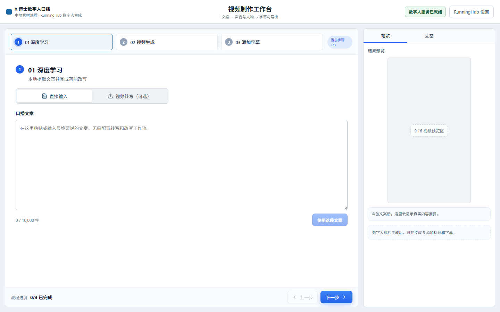

# X 博士数字人口播

一个面向 Windows 用户的本地数字人口播工作台。用户准备文案、参考声音和人物视频，软件在本机完成格式处理，再使用用户自己的 RunningHub API Key 生成数字人成片。

## 这个项目能做什么

- 直接粘贴最终口播文案，不需要额外的文本工作流
- 上传参考音频和人物视频并自动转换为适合上传的格式
- 调用内置的 RunningHub 数字人工作流
- 轮询生成进度，完成后预览和下载 MP4
- 可选接入视频转写与文案改写工作流
- 在本地为成片添加标题和字幕预览

AI 推理全部使用用户自己的 RunningHub 账户。本项目不提供共享 API Key、积分、中转服务器或云端素材存储。

## 五分钟开始使用

### 1. 安装基础环境

首次使用只需要提前安装：

- Windows 10 或 Windows 11
- [Node.js 20.19+](https://nodejs.org/zh-cn/download)
- [Python 3.10+](https://www.python.org/downloads/windows/)

安装 Python 时勾选 **Add Python to PATH**。FFmpeg 不需要手动安装；start.bat 找不到 FFmpeg 时会下载便携版本到项目的 .runtime 目录。

### 2. 启动软件

下载源码 ZIP 并完整解压，然后双击 start.bat。

第一次启动会自动执行以下操作：

1. 创建项目专用 .venv
2. 安装 Python 和 Node.js 依赖
3. 检测或下载便携 FFmpeg
4. 构建生产版本
5. 自动选择空闲端口并打开浏览器

首次安装通常需要几分钟。以后启动会复用已经安装的依赖。关闭启动窗口即可退出本地服务。

### 3. 配置 RunningHub

点击右上角 **RunningHub 设置**，只需填写自己的 API Key，再点击 **测试连接**。

项目已内置以下数字人预设：

| 配置 | 值 |
|---|---:|
| Workflow ID | 2091491962556866562 |
| 声音输入节点 | 37 |
| 视频输入节点 | 40 |
| 文本输入节点 | 58 |

保存的 API Key 位于当前 Windows 用户的本地应用数据目录，不会返回给浏览器，也不会进入 Git 仓库。

### 4. 制作第一条视频

1. 在 **01 深度学习** 选择“直接输入”，粘贴最终口播文案。
2. 点击“使用这段文案”。
3. 进入 **02 视频生成**，分别选择参考音频和人物视频。
4. 点击“提交至 RunningHub 生成视频”。
5. 等待生成完成。通常需要 2-10 分钟，具体取决于 RunningHub 队列和视频长度。
6. 在右侧结果区播放检查，并点击“下载当前成片”。
7. 如需标题或字幕，进入 **03 添加字幕** 生成最终预览。

建议素材：

- 参考音频：WAV、MP3 或 M4A，建议 30 秒以上，最大 500 MB
- 人物视频：MP4 或 MOV，正面出镜、光线稳定，建议 10 秒以上，最大 2 GB
- 文案：与参考音频使用同一种语言，避免非常规符号和过长停顿

## 可选：视频转写与文案改写

数字人核心流程不依赖这两个功能。只有需要“从现有视频自动获得文案”时，才在 RunningHub 设置中展开可选区域并填写：

- 视频转写 Workflow ID
- 文案改写 Workflow ID

只配置转写、不配置改写也可以使用；软件会保留转写原文。节点输入约定见 [workflows/README.md](workflows/README.md)。

## 诊断与常见问题

双击 doctor.bat 可以检查 Node.js、npm、Python、FFmpeg、依赖、生产构建和 API Key 配置状态。

### 双击后窗口立即关闭

运行 doctor.bat 查看缺少的环境。最常见原因是 Python 安装时没有勾选 Add Python to PATH。

### 浏览器没有打开

在启动窗口中找到类似 http://127.0.0.1:54321 的地址，手动复制到浏览器。端口每次可能不同，这是为了避免与其他本地软件冲突。

### RunningHub 测试失败

- 确认 API Key 没有多余空格
- 确认 RunningHub 账户可以通过 OpenAPI 访问工作流 2091491962556866562
- 查看账户余额、并发限制和 RunningHub 服务状态
- 不要把 API Key 粘贴到 Issue、截图或运行日志

### 视频或音频处理失败

运行 doctor.bat 检查 FFmpeg。如果自动下载被网络拦截，也可以把 ffmpeg.exe 和 ffprobe.exe 放入项目的 bin 目录。

### 点击“停止等待”后为什么 RunningHub 还在运行

“停止等待”只停止浏览器轮询，不会取消已经在 RunningHub 创建的任务，也不能保证停止计费。可稍后回到 RunningHub 控制台查看该任务。

## 本地数据与隐私

默认数据目录：

~~~text
%LOCALAPPDATA%\XDoctorTalkingHead\
~~~

其中包含设置、临时文件和本地预览。API Key 以明文保存在当前 Windows 用户目录，因此不要与他人共享 Windows 账户。浏览器只访问同机服务，服务拒绝非本机 Origin。

声音、人物视频、文案和生成任务会按用户操作发送到 RunningHub。请阅读 RunningHub 当前的隐私、留存和计费规则，并且只处理拥有合法授权的声音、肖像和素材。

自动下载的 FFmpeg 是独立的第三方程序，遵循 FFmpeg 及下载发行版自身的许可证，不属于本仓库的 Apache-2.0 授权范围。

## 开发与测试

~~~powershell
npm ci
py -3.11 -m venv .venv
.\.venv\Scripts\python -m pip install -r requirements.txt
npm test
npm run lint
npm run build
~~~

开发模式：

~~~powershell
npm run dev:api
npm run dev
~~~

正式启动使用单个 Express 进程同时提供前端和本机 API，不再依赖固定的 5173/8787 端口。单元测试使用模拟 HTTP，不创建付费 RunningHub 任务。

## 参与贡献

贡献流程见 [CONTRIBUTING.md](CONTRIBUTING.md)，安全问题请按 [SECURITY.md](SECURITY.md) 私下报告。

## License

Copyright 2026. Licensed under the [Apache License 2.0](LICENSE).
